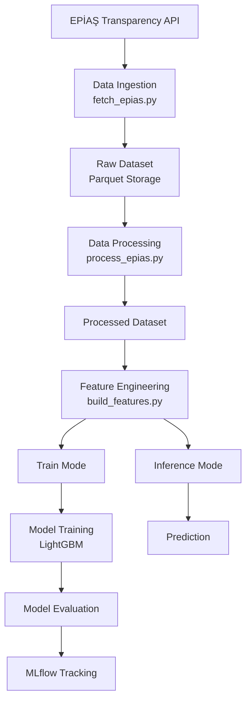
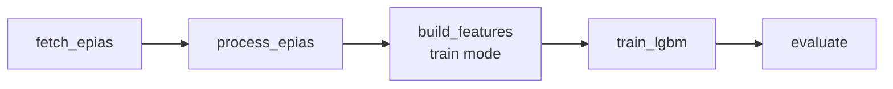
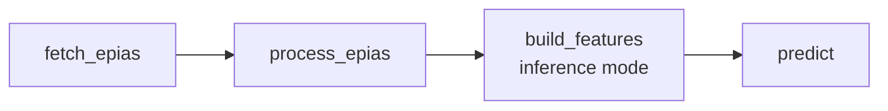

# ⚡ Electricity Price Forecasting Pipeline (PTF)

This project implements an **end-to-end machine learning pipeline** for forecasting the Turkish electricity market price (**PTF**) using data from the **EPİAŞ Transparency Platform**.

The goal of this project is not only to build a forecasting model, but to design a **reproducible, modular, and production-style data pipeline** that includes:

- automated data ingestion
- data preprocessing
- time-series feature engineering
- baseline and statistical model comparison
- machine learning modeling
- experiment tracking
- workflow orchestration

The pipeline uses:

- **LightGBM** for machine learning forecasting
- **MLflow** for experiment tracking
- **Apache Airflow** for workflow orchestration

---

# 🏗 System Architecture

The system is implemented as a **modular pipeline**, where each stage is an independent component.

## 📥 Data Ingestion

Electricity price data is collected from the **EPİAŞ Transparency Platform API**.

The ingestion script performs the following steps:

- authentication through the **CAS authentication service**
- downloading **MCP / PTF market price data**
- transforming API responses into structured **Pandas DataFrames**
- storing the results as **partitioned Parquet datasets**

### Incremental Data Fetching

The ingestion pipeline supports **incremental updates**.

Instead of downloading the entire dataset every time:

- the script checks the **latest timestamp** in the existing dataset
- data fetching starts **from that point**
- a small **overlap window** is used to avoid missing observations

This design allows the pipeline to run efficiently in **scheduled workflows**.

---

## 🧹 Data Processing

Raw API responses require cleaning before modeling.

The processing stage performs:

- column name standardization  
- timestamp parsing  
- numeric conversion of the `ptf` column  
- corrupted record removal  
- duplicate timestamp removal  
- chronological sorting  
- detection of missing hourly observations  

The output is a **clean and structured time-series dataset** ready for feature engineering.

---

## 📊 Exploratory Data Analysis

Initial analysis of the time series revealed several important patterns:

- strong **hourly structure**
- strong **daily seasonality**
- visible **weekly patterns**
- strong predictive power of lag features such as **lag_24** and **lag_168**

These observations guided the **feature engineering strategy and model design**.

---

## ⚙ Feature Engineering

Feature engineering is a **core component** of the pipeline.

The following feature groups are generated.

### Time Features

- hour of day
- day of week
- weekend indicator
- cyclic transformations (**sin / cos encoding**)

### Lag Features

- `lag_1`
- `lag_24`
- `lag_168`
- `lag_336`

### Rolling Statistics

- `rolling_mean_24`
- `rolling_mean_168`

### Difference Features

- `diff_1`
- `diff_24`
- `diff_168`

---

## 🧠 Train Mode

In **train mode**, the pipeline generates a target variable:

target = ptf shifted by 24 hours

This allows the model to **predict the electricity price at the same hour on the following day**.

---

## 🔮 Inference Mode

In **inference mode**:

- only **features are generated**
- the **target column is not created**

This allows the same pipeline to be used for **real-time prediction**.

## 📈 Baseline Model

A simple baseline model was implemented using the **lag-24 approach**.

The prediction rule is:

PTF(t) ≈ PTF(t - 24)

Electricity markets often exhibit **strong daily repetition**, making this baseline surprisingly competitive.

| Model | MAE | RMSE | MAPE |
|------|------|------|------|
| Baseline (lag_24) | 457.11 | 723.33 | 136.89 |

---

## 📉 SARIMA Model

A classical statistical model was implemented for comparison.

Selected configuration:

SARIMA(2,1,2)(1,1,0,24)

The **seasonal period of 24 hours** captures the daily structure of electricity prices.

| Model | MAE | RMSE | MAPE |
|------|------|------|------|
| SARIMA (2,1,2)(1,1,0,24) | 558.27 | 863.37 | 200.75 |

The SARIMA model **did not outperform the lag-based baseline**.

---

## 🤖 LightGBM Model

A machine learning approach was implemented using **LightGBM**.

The dataset was split chronologically into:

- training set
- validation set
- test set

### Best Hyperparameters

| Parameter | Value |
|-----------|------|
| n_estimators | 800 |
| learning_rate | 0.02 |
| max_depth | 6 |
| num_leaves | 31 |
| min_child_samples | 50 |
| subsample | 1.0 |
| colsample_bytree | 0.8 |

---

### Validation Results

| Metric | Value |
|------|------|
| MAE | 296.55 |
| RMSE | 406.59 |
| MAPE | 69.41 |

---

### Test Results

| Metric | Value |
|------|------|
| MAE | 392.49 |
| RMSE | 548.30 |
| MAPE | 246.74 |

---

## 📊 Model Comparison

| Model | MAE | RMSE | MAPE |
|------|------|------|------|
| Baseline (lag_24) | 457.11 | 723.33 | 136.89 |
| SARIMA | 558.27 | 863.37 | 200.75 |
| LightGBM | **392.49** | **548.30** | 246.74 |

The **LightGBM model achieved the lowest MAE and RMSE**, indicating better predictive performance.

The large **MAPE values** are caused by periods where **PTF approaches zero**, which makes percentage-based errors unstable.

## 🔬 Experiment Tracking

The training pipeline integrates **MLflow** for experiment tracking.

MLflow logs the following information for each experiment:

- hyperparameters  
- validation metrics  
- test metrics  
- trained model artifacts  

This allows:

- reproducibility of experiments
- easy comparison between different model runs
- centralized storage of experiment results

---

## 🔄 Workflow Automation

The pipeline is orchestrated using **Apache Airflow**.

Two workflows were implemented:

- **Training Pipeline**
  - data ingestion
  - data processing
  - feature engineering
  - model training
  - model evaluation
  - MLflow logging

- **Inference Pipeline**
  - incremental data ingestion
  - data processing
  - inference feature generation
  - loading the trained model
  - generating electricity price predictions

  ## 🔁 Retraining Pipeline

This workflow periodically retrains the forecasting model using newly available data.

## 🔮 Inference Pipeline

This workflow generates new price predictions using the latest data.

Separating training and inference pipelines improves reliability and maintainability.

## 🛠 Technologies Used

The project uses the following technologies and tools:

- **Python**
- **Pandas**
- **LightGBM**
- **Statsmodels**
- **MLflow**
- **Apache Airflow**
- **Parquet**
- **EPİAŞ Transparency Platform API**

---

## 🧠 Conclusion

This project demonstrates the design of a **production-style machine learning pipeline** for electricity price forecasting.

The system includes:

- automated data ingestion  
- robust data preprocessing  
- time-series feature engineering  
- baseline and statistical model comparison  
- machine learning modeling  
- experiment tracking with **MLflow**  
- workflow orchestration using **Apache Airflow**

The final architecture is **modular**, **reproducible**, and suitable for **automated retraining and prediction generation**.